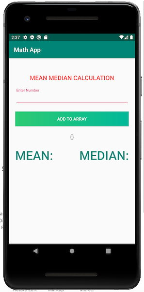
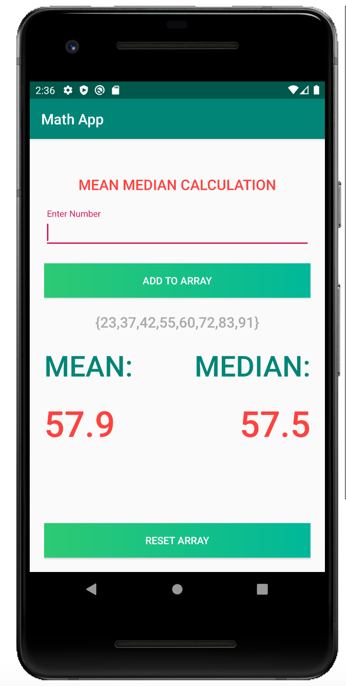

# Math-App
Simple demo application that showcases calculating Mean and Median using best practices

# App Screenshot

<table>
  <tr>
    <td>Math App Empty Screen</td>
    <td>Math App Test Calculation</td>
  </tr>
  <tr>
    <td></td>
    <td></td>
  </tr>
</table>
 
# Project Description
 
### Design Pattern - MVVM
This project uses the MVVM design pattern. Business logic is written in the viewmodel class, user interface is updated in view class. Databinding is used for the ui to update automatically when the data changes in the viewmodel class. This also helps writing the unit test as only viewmodel classes has to be tested being the only section responsible for business logic.
 
### Data Binding - LiveData
Views are directly bound to data via LiveData and DataBinding that will help the UI to observe for data changes and thus update automatically when the data changes.
 
### Dependency Injection - Koin
Viewmodel class is declared as module and injected to the activity helping segragating the object definitions to the respective module
